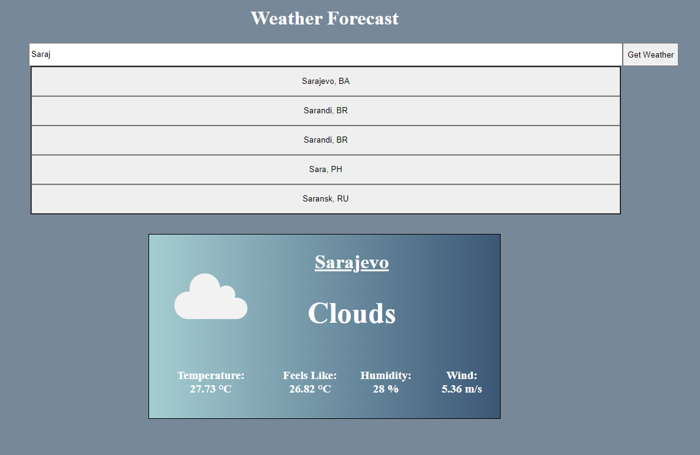

#React Weather

Practice project - a weather forecast app made using React. The goal of the project is learning the basics of React and fetching data using APIs.

The project uses GeoDB Cities API to autocomplete cities in the search bar and the openweathermap.org API for fetching the weather data for selected cities.

